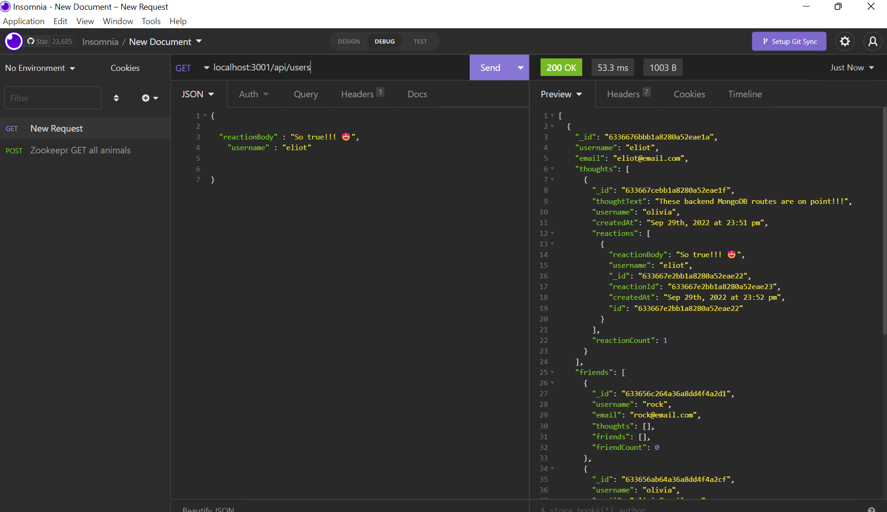

# Reactions

**A backend for a social media application using Node, Express, MongoDB, and Mongoose for data structuring in the NoSQL database. This was a great opportunity to get some more practice building RESTful APIs and Modularizion of controllers and routes. This app used a less verbose form of defining controller methods thanks to new ES6 dialects. Had fun on this project and overall pleased with the end result**

## Table of Contents

[Installation Instructions](#installation-instructions)

[Usage Information](#usage-information)

[Demo Video](#video)

[Contribution Guidelines](#contribution-guidelines)

[Collaboration Credits](#collaboration-credits)

[Questions](#questions)

[License](#license)

## Installation Instructions

Mongoose and Node environments are both necessary to install this application locally. Simply clone repo, npm i in the terminal to install packages, then run npm start to create the DB. 
## Usage Information

Documents can be added and modified through the RESTful API via postman or insomnia. See controller directory for specifics of the routes. Watch tutorial video for more information and to see CRUD methods in action.

## Video
[Open link](https://drive.google.com/file/d/1N80CxvdgbpwZjrryR7aQzBV8M9rCQDUI/view) to view a brief [video](https://drive.google.com/file/d/1N80CxvdgbpwZjrryR7aQzBV8M9rCQDUI/view) tutorial of Reactions' capabilties.
## Contribution Guidelines

For any questions about the app or to contribute, please reach out via email.
## Collaboration Credits

This app is an assignment for a coding boot camp. It is a ground up build however some coding structure is borrowed from the lesson plan and sited withing the comments.
## Questions
For information about the developer, see my [GitHub Profile](https://github.com/eclevela-1234)

For general questions, please email me: eliothead@live.com
## License
Copyright (c)  2022 by [eclevela-1234](https://github.com/eclevela-1234)

MIT License

Permission is hereby granted, free of charge, to any person obtaining a copy
of this software and associated documentation files (the "Software"), to deal
in the Software without restriction, including without limitation the rights
to use, copy, modify, merge, publish, distribute, sublicense, and/or sell
copies of the Software, and to permit persons to whom the Software is
furnished to do so, subject to the following conditions:

The above copyright notice and this permission notice shall be included in all
copies or substantial portions of the Software.

THE SOFTWARE IS PROVIDED "AS IS", WITHOUT WARRANTY OF ANY KIND, EXPRESS OR
IMPLIED, INCLUDING BUT NOT LIMITED TO THE WARRANTIES OF MERCHANTABILITY,
FITNESS FOR A PARTICULAR PURPOSE AND NONINFRINGEMENT. IN NO EVENT SHALL THE
AUTHORS OR COPYRIGHT HOLDERS BE LIABLE FOR ANY CLAIM, DAMAGES OR OTHER
LIABILITY, WHETHER IN AN ACTION OF CONTRACT, TORT OR OTHERWISE, ARISING FROM,
OUT OF OR IN CONNECTION WITH THE SOFTWARE OR THE USE OR OTHER DEALINGS IN THE
SOFTWARE.

For more information visit https://opensource.org/licenses/MIT

